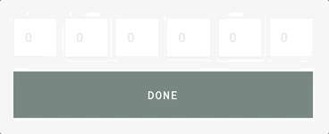

---

> Simple Verification Code input for ReactJS

[](https://www.npmjs.com/package/@ohmunity/verification-code)   

## Demo



**Live demo coming soon**

## Install

```bash
npm install --save @ohmunity/verification-code
```

## Usage

```jsx
import React, { Component } from "react";

import VerificationCode from "@ohmunity/verification-code";

const App = () => {
  return <VerificationCode type="number" total={6} onComplete={console.log} />;
};
```

You can also Customize the input field

```jsx
import React, { Component } from "react";

import VerificationCode from "@ohmunity/verification-code";

const App = () => {
  return (
    <VerificationCode
      type="number"
      total={6}
      onComplete={console.log}
      Component={React.forwardRef((props, ref) => (
        <FormField ref={ref} {...props} />
      ))}
    />
  );
};
```

## Props

| Prop        | Type                 | Description                                         |          |
| ----------- | -------------------- | --------------------------------------------------- | -------- |
| type        | "number" \| "string" | input type                                          | required |
| total       | number               | total of digits                                     | required |
| value       | string               | default value                                       |          |
| id          | string               | element id                                          |          |
| placeholder | string               | element placeholder (same for all)                  |          |
| disabled    | boolean              | element disabled status                             |          |
| required    | boolean              | element required status                             |          |
| onChange    | Function             | calls the function every time a field changes       |          |
| onComplete  | Function             | call the function once all the fields are completed |          |
| Component   | React Component      | support for custom React Component                  |          |

## TODO

- [ ] Add default styles and `className` support
- [ ] Add tests
- [ ] Add live demo

## License

MIT © [Ohmunity™](https://ohmunity.com/)
